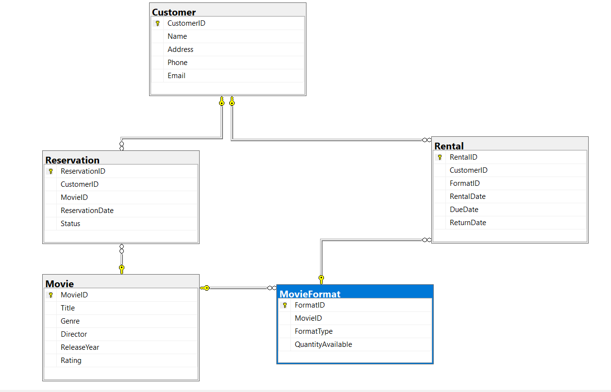

# RentalFlix ERD
## Overview
### Design an Entity-Relationship Diagram (ERD) for a movie rental service, capturing the key entities and relationships required to manage the service efficiently.

> **Explanation:**  
> Movie - MovieFormat: 
> One-to-Many: One movie can have multiple formats. 
Movie.MovieID → MovieFormat.MovieID.
>
> Customer - Rental: 
> One-to-Many: One customer can have multiple rentals. 
Customer.CustomerID → Rental.CustomerID.
>
> MovieFormat - Rental: 
> Many-to-One: Many rentals can be associated with one movie format. 
Rental.FormatID → MovieFormat.FormatID.
>
> Movie - Reservation: 
> One-to-Many: One movie can have multiple reservations. 
Movie.MovieID → Reservation.MovieID.
>
> Customer - Reservation: 
> One-to-Many: One customer can have multiple reservations. 
Customer.CustomerID → Reservation.CustomerID. 

## ERD

